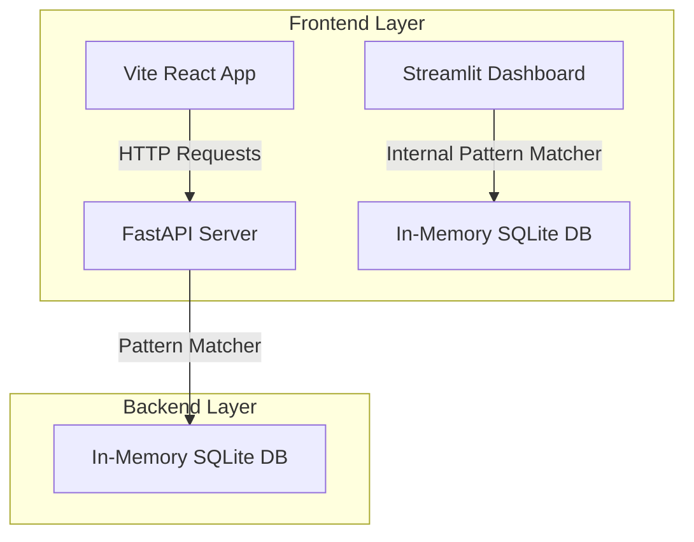

# 🌌 DataOrbit: Student Performance Analytics Platform

DataOrbit is an elegant, high-fidelity student telemetry dashboard and intelligence platform. It features a modern, clean light monochrome design based on **Beach White (`#faf8f5`)** and **English Blue (`#1b3a5b`)**, equipped with automated AI observations and an in-memory natural language **Text-to-SQL Query Console**.

The platform is available in two variants:
1. **React Web Application**: Built with React, Vite, Tailwind CSS, and Recharts, connected to a FastAPI backend.
2. **Streamlit Analytics Dashboard**: A standalone Streamlit dashboard with custom CSS widget overrides, custom Plotly charts, and an embedded SQLite memory query compiler.

---

## 🚀 Key Features

### 1. 🤖 AI Text-to-SQL Query Console
- **Natural Language Translation**: Ask questions like *"Who has the highest GPA?"* or *"Average attendance in Computer Science"* and watch the pattern-matcher translate them into standard SQLite queries.
- **Direct SQL Access**: Allows execution of custom raw SQL queries directly against the student dataset.
- **Instant Tabular Results**: Fetches matched records and compiles them into a structured database grid on the fly.
- **Legible Suggestion Templates**: Fast, one-click template pills to demo standard telemetry queries instantly.

### 2. 📥 Subtle CSV Importer (Main Page & Sidebar)
- **Inline Collapsible Importer**: Drag-and-drop CSV uploader directly on the dashboard screen (in addition to the sidebar uploader) for effortless updates.
- **Automated Column Mapping**: Auto-detects student IDs, names, departments, semesters, GPAs, and attendance ratios.
- **Dynamic Scale Adjuster**: Automatically scales GPA metrics (from 4.0 or 100.0 scales to a standard 10.0 scale) and attendance rates (to 100.0%).
- **Space Mock Data Fallback**: Instantly generates synthetic student space academy cohort telemetry if no CSV is uploaded.

### 3. 📊 Advanced Visual Aids
- **Grade Distribution Chart**: Categorizes students into A, B, C, D, and F buckets with custom-themed visual graphs.
- **Attendance Heatmap**: Pivots average attendance ratios across departments and semesters.
- **Correlation Scatter Plot**: Maps attendance ratios against GPAs, showing risk thresholds.
- **Top Factor Analysis**: Renders horizontal bar charts reflecting calculated regression correlation weights against grades.

### 4. ⚠️ At-Risk Student Roster
- Detects students having GPAs below 5.0 OR attendance below 40%.
- Highlights at-risk records with a soft red alert theme (`#c53030`) and offers a one-click CSV download.

---

## 🎨 Design Theme & Brand Guidelines

DataOrbit follows a premium **Beach White & English Blue** Notion-like minimalist layout:
* **Backgrounds**: Beach White (`#faf8f5`) and Pure White (`#ffffff`) for card layouts.
* **Typography**: English Blue (`#1b3a5b`) for headers/titles and Muted Slate (`#4a607a`) for helper descriptions and secondary content.
* **Alert States**: Soft mint green (`#2f855a`) for positive notices, and dark red (`#c53030`) for risk flags.
* **Cards & Forms**: Sleek border lines (`#cbd5e1`), micro-animations, and subtle shadows.

---

## 🛠️ Architecture & Tech Stack



* **Backend**: FastAPI (Python) serving SQL translation, data parsing, and metadata compilation.
* **Vite React Frontend**: React 18, Vite, Lucide icons, and Recharts.
* **Streamlit App**: Standalone Python dashboard using custom CSS overrides targeting BaseWeb selectboxes, sliders, multiselect pills, file uploaders, and data tables.

---

## 🏃‍♂️ Getting Started

### Prerequisites
* Python 3.10 or higher
* Node.js 18 or higher

---

### Setup & Run: FastAPI Backend + React Web App

1. **Install Backend Dependencies & Start Server**:
   ```bash
   # Navigate to the project directory
   pip install fastapi uvicorn pandas numpy sqlite3
   
   # Start backend FastAPI server
   python main.py
   ```
   *The backend will boot up at `http://localhost:8000/`.*

2. **Install Frontend Dependencies & Start Dev Client**:
   ```bash
   # In a new terminal window
   npm install
   
   # Start Vite React server
   npm run dev
   ```
   *The React web app will launch at `http://localhost:5173/`.*

---

### Setup & Run: Standalone Streamlit Dashboard

If you prefer running the single-page, self-contained dashboard:

```bash
# Install Streamlit and visualization modules
pip install streamlit pandas numpy plotly

# Launch the dashboard
streamlit run app.py --server.port 8501
```
*The Streamlit analytics console will launch at `http://localhost:8501/`.*

---

## 📂 Data File Specifications

To import custom documents, format your CSV columns using similar name guidelines (the platform's pattern matcher will auto-detect them):

| Metric | Target CSV Headers (Examples) | Mapping Action |
|---|---|---|
| **Student ID** | `student_id`, `id`, `roll_number` | Key Identifier |
| **Name** | `name`, `full_name`, `student_name` | Name Display |
| **Department** | `department`, `dept`, `stream` | Pivot Filtering |
| **Semester** | `semester`, `sem`, `term` | Filter Syncing |
| **GPA** | `gpa`, `grade_point_average`, `cgpa` | Normalized to 10.0 scale |
| **Attendance %** | `attendance`, `attendance_pct`, `attendance_rate` | Normalized to 100.0% |

---

🌌 *Designed and engineered for the Student Performance Analytics core.*
